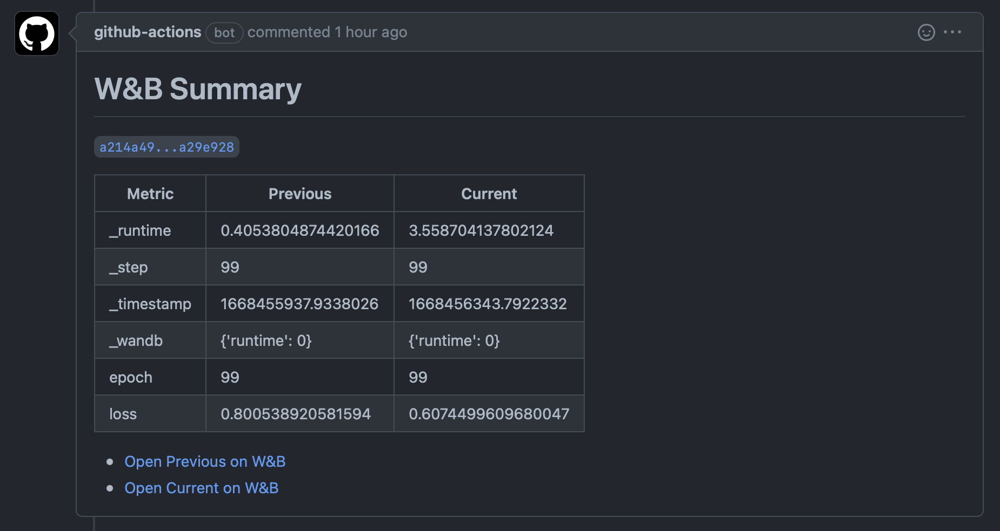

# wandb-action

This action leaves comments on pull requests and commits with [Weights & Biases](https://wandb.ai) run summaries and comparisons.

## Example

For a full example, see [this repository](https://github.com/bencevans/wandb-action-example).

### Commit Report


### Pull Request Report



### Workflow Steps

```yml
- name: Run experiment that reports to Weights & Biases
  run: python train.py
  env:
    WANDB_API_KEY: ${{ secrets.WANDB_API_KEY }}

- name: Report WandB Results
  uses: bencevans/wandb-action@v1
  env:
    GITHUB_TOKEN: ${{ github.token }}
    WANDB_API_KEY: ${{ secrets.WANDB_API_KEY }}

    # Optional. Defaults to the repository owner/name.
    # WANDB_ENTITY: ${{ secrets.WANDB_ENTITY }}
    # WANDB_PROJECT: ${{ secrets.WANDB_PROJECT }}
```

## Setup

1. Retrieve your Weights & Biases API key from your [account settings](https://app.wandb.ai/settings).
2. Add the API key to your repository secrets as `WANDB_API_KEY`.
3. If your repository path (github.com/[owner/name]) is different to your Weights & Biases project path (wandb.ai/[entity_or_owner/project]), add the entity and project to your repository secrets as `WANDB_ENTITY` and `WANDB_PROJECT`.
4. Add the workflow steps as shown above to your workflow file.

## Environment Variables

### Required

- `WANDB_API_KEY` - API key for Weights & Biases. You can find this in your [account settings](https://app.wandb.ai/settings).
- `GITHUB_TOKEN` - Token for GitHub. This is automatically generated by GitHub Actions but needs to be passed to the action.

### Optional

- `WANDB_PROJECT` - Project name to use for the run. Defaults to the repository name.
- `WANDB_ENTITY` - Entity name to use for the run. Defaults to the repository owner.


## License

[MIT](LICENSE)
